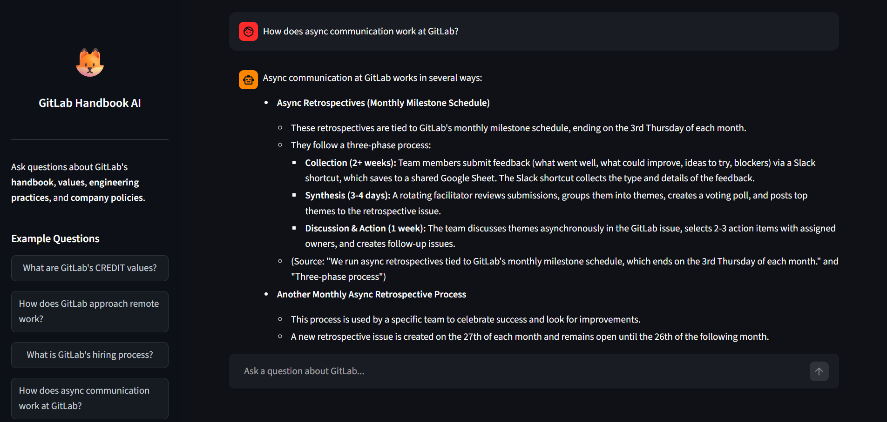
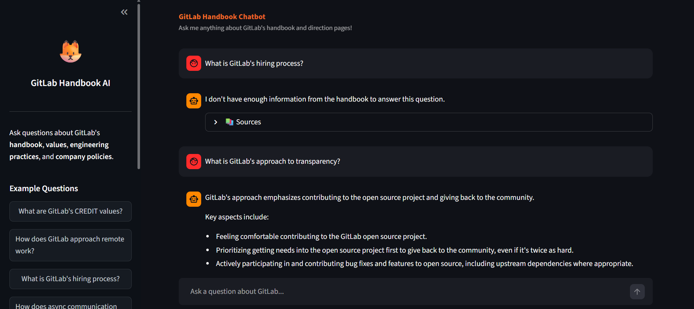

# Project Report

## GitLab Handbook AI Chatbot
### A Retrieval-Augmented Generation (RAG) Based Conversational Assistant

---

**Submitted by:** [Khushboo Chaurasiya]
**Date:** March 2026

---

## 1. Introduction

### Problem Statement

GitLab is one of the world's most transparent companies, publishing thousands of pages of internal documentation — known as the **GitLab Handbook** — openly on the internet. This handbook covers everything from company values and communication practices to engineering processes and hiring guidelines.

While this openness is admirable, it creates a practical problem: **the handbook is massive**. Employees trying to find a specific policy, and candidates exploring GitLab's culture, often have to sift through hundreds of pages manually. Search engines help to some extent, but they return lists of links rather than direct, context-specific answers. Reading through those pages is time-consuming and mentally exhausting, especially when someone just needs a quick, precise answer.

### Motivation

The idea behind this project came from a simple observation — if this documentation is publicly available, why can't a user just ask a question and get a clear answer instead of hunting through pages? That's exactly the gap this chatbot fills.

### How the Chatbot Solves This

The **GitLab Handbook AI Chatbot** is a conversational assistant that lets users type their questions in plain English and receive accurate, context-aware answers — drawn directly from GitLab's own handbook. It doesn't guess or hallucinate information; it retrieves relevant sections from the actual documentation and uses a language model to generate a coherent, readable response from that content.

This makes it a genuinely useful tool for:
- New employees wanting to understand GitLab's culture or internal processes
- Job seekers exploring whether GitLab is the right fit for them
- Anyone who needs quick answers without reading through hundreds of documentation pages

---

## 2. Objectives

The primary goals of this project are:

- Build a question-answering chatbot grounded in GitLab's official Handbook and Direction pages
- Use a **RAG (Retrieval-Augmented Generation)** pipeline to ensure responses are factual and traceable
- Provide a clean, simple user interface that anyone can use without technical knowledge
- Handle edge cases gracefully — including API rate limits and ambiguous or out-of-scope queries
- Demonstrate the practical value of combining a vector database with a large language model (LLM)

---

## 3. System Architecture

### What is RAG?

**Retrieval-Augmented Generation (RAG)** is a design pattern where, instead of asking an LLM to answer from memory alone, we first retrieve relevant documents from a knowledge base and then pass that information to the LLM along with the user's question. The model generates an answer *based on what it has been given*, rather than relying on potentially outdated or inaccurate training data.

This is particularly important for a project like this, where accuracy matters — we want the chatbot to say things that are actually in the GitLab Handbook, not things the model has "learned" from elsewhere.

### Full Pipeline

```
User Query
    ↓
Text Embedding (Google Embedding Model)
    ↓
ChromaDB — Vector Similarity Search
    ↓
Top-K Most Relevant Chunks Retrieved
    ↓
Chunks + User Query sent to LLM (Gemini Flash)
    ↓
LLM Generates Final Response
    ↓
Response shown to User
```

**Step-by-step explanation:**

1. **User Query** — The user types a question in the chat interface.
2. **Embedding** — The query is converted into a numerical vector (embedding) that captures its meaning.
3. **Vector Search** — ChromaDB searches for stored document chunks whose embeddings are most similar to the query's embedding.
4. **Context Retrieval** — The top matching chunks (e.g., top 5) are fetched and combined into a context block.
5. **LLM Prompt** — The context + the original query are sent as a structured prompt to Gemini Flash.
6. **Response** — The LLM reads the context and generates a clear, human-readable answer.

---

## 4. Tech Stack

| Component | Technology Used |
|---|---|
| **Backend** | Python, FastAPI |
| **LLM** | Google Gemini Flash (`gemini-1.5-flash`) |
| **Embeddings** | Google Generative AI Embedding Model |
| **Vector Database** | ChromaDB (local persistent storage) |
| **Frontend** | Streamlit |
| **Data Scraping** | `requests`, `BeautifulSoup` |
| **Data Handling** | `langchain`, `langchain-community` |
| **Environment Config** | `python-dotenv` |

**Why these choices?**
- **FastAPI** is lightweight, fast, and well-suited for building REST APIs around ML models.
- **ChromaDB** is easy to set up locally, requires no external server, and integrates smoothly with Python.
- **Streamlit** allows rapid UI development — a full chat interface can be built in a few dozen lines.
- **Google's embedding model** aligns well with Gemini, ensuring semantic consistency between retrieval and generation.

---

## 5. Data Collection and Processing

### Data Source

The data for this chatbot comes directly from **GitLab's public Handbook and Direction pages**, scraped using Python's `requests` library and parsed using `BeautifulSoup`. Since the handbook is publicly available, no authentication is required.

### Preprocessing

Once the raw HTML is fetched, the following steps are applied:
- HTML tags, scripts, navbars, and footers are stripped out, leaving clean text
- Excessive whitespace and special characters are normalized
- Empty sections or boilerplate text (like cookie banners) are removed

### Chunking Strategy

After cleaning, the text is split into **smaller, overlapping chunks** using LangChain's `RecursiveCharacterTextSplitter`.

- **Chunk size:** ~500–1000 characters
- **Overlap:** ~100–200 characters between consecutive chunks

### Why Chunking Matters

An LLM can only process a limited amount of text in one request (its "context window"). More importantly, if we send the entire handbook as context for every query, it would be slow, expensive, and confusing for the model. Chunking ensures that:
- Only the most *relevant* pieces of text are retrieved
- The model isn't overwhelmed with irrelevant content
- Retrieval is fast and precise

---

## 6. Chatbot Implementation

### Query Processing

When a user sends a query:

1. The query string is passed to Google's embedding model to generate a vector representation
2. ChromaDB performs a **cosine similarity search** between the query vector and all stored chunk vectors
3. The **top-k chunks** (typically 3–5) with the highest similarity scores are returned
4. These chunks are concatenated and inserted into a prompt template

### Prompt Construction

The prompt sent to Gemini is structured deliberately:

```
You are a helpful assistant. Use only the information provided below to answer the question.

Context:
[retrieved chunks here]

Question: [user's query]

Answer:
```

This framing ensures the model stays grounded in the retrieved content and doesn't drift into hallucination.

### Response Generation

Gemini Flash reads the context and generates a fluent, concise response. The answer is then returned to the frontend and displayed in the chat window.

---

## 7. Key Design Decisions

### Why Gemini Flash Instead of Gemini Pro?

Gemini Pro offers more reasoning depth, but Gemini Flash is:
- **Faster** — responses arrive in under 2 seconds typically
- **Cheaper** — significantly lower API cost per call
- **Sufficient** — for RAG-based Q&A, the heavy lifting is done by the retrieval step. The LLM only needs to *summarize* well-retrieved context, not reason from scratch.

### Why RAG Instead of Fine-Tuning or Prompting Alone?

| Approach | Problem |
|---|---|
| Direct LLM (no RAG) | Model may hallucinate or give outdated answers |
| Fine-tuning on handbook | Expensive, requires retraining whenever docs change |
| **RAG** | Accurate, updatable, and cost-effective ✓ |

RAG also allows the knowledge base to be updated simply by re-ingesting new pages — no model retraining needed.

### Chunk Size and Top-K Choices

- **Chunk size (500–1000 chars):** Small enough to be specific, large enough to carry meaningful context. Very small chunks lose context; very large ones dilute relevance.
- **Top-K = 5:** Sends enough context for the model to form a complete answer without overloading the prompt. Increasing K beyond ~5 showed diminishing returns while increasing latency.

### Trade-offs Considered

- **Accuracy vs. Speed:** Larger K = more context = slower. K=5 was a practical balance.
- **Local vs. Cloud Storage:** ChromaDB runs locally, which avoids cloud costs but limits scalability. For a student project, this is an acceptable trade-off.
- **Scraping depth vs. coverage:** Scraping every handbook page would take too long and risk being throttled. Key sections were prioritized.

---

## 8. Features

- **Context-aware responses:** Every answer is grounded in actual GitLab Handbook content — not generic LLM knowledge
- **Conversational UI:** Clean chat interface built with Streamlit, usable by anyone
- **Graceful error handling:** If the API quota is exceeded or a request fails, the user sees a friendly error message instead of a crash
- **Fallback behavior:** If no relevant chunks are found for a query, the chatbot acknowledges this honestly rather than making something up
- **Follow-up query support:** Users can ask follow-up questions naturally within the same session

---

## 9. Challenges and Solutions

| Challenge | Solution |
|---|---|
| **API Rate Limits** | Added retry logic with exponential backoff; batched embedding requests to stay within quota |
| **Large Document Volume** | Used chunking + incremental ingestion; only re-ingest changed pages |
| **Slow Local Performance** | ChromaDB queries are fast; bottleneck was network latency to Gemini API, mitigated by caching frequent queries |
| **Irrelevant Chunk Retrieval** | Tuned chunk size and overlap; improved prompt structure to instruct the model to stay on-topic |
| **HTML Noise in Scraped Data** | Wrote targeted BeautifulSoup parsers to extract only main content areas, skipping navbars and sidebars |

---

## 10. Deployment

The application is designed to be deployed on **Streamlit Community Cloud**, which provides free hosting for public GitHub repositories. The deployment setup includes:

- A `requirements.txt` listing all Python dependencies
- A `.streamlit/config.toml` for UI configuration
- API keys managed through **Streamlit Secrets** (so they are never exposed in code)

> **Note:** The project is currently in a locally runnable state. Deployment to a public URL is planned as a next step.

**To run locally:**
```bash
# Install dependencies
pip install -r requirements.txt

# Run the app
streamlit run app.py
```

---

## 11. Future Improvements

- **Conversational Memory:** Store previous messages in session state so the model can understand follow-up questions in context (e.g., "What about the hiring process?" after asking about values)
- **Re-ranking Retrieved Chunks:** Use a cross-encoder model to re-rank retrieved chunks by relevance before sending them to the LLM — this improves answer quality significantly
- **Hybrid Search:** Combine vector search with keyword (BM25) search for better coverage on exact terms and names
- **Cost Optimization:** Cache embeddings for repeated queries; use streaming responses to improve perceived speed
- **Improved UI:** Add source citations below each answer, showing which page of the handbook was referenced
- **Multi-source Support:** Extend the knowledge base beyond the handbook to include GitLab's blog, API docs, and changelogs

---

## 12. Conclusion

This project demonstrates how a **Retrieval-Augmented Generation pipeline** can turn a massive, hard-to-navigate documentation corpus into an interactive, conversational assistant. By combining ChromaDB for efficient semantic search and Google Gemini Flash for natural language generation, the chatbot delivers accurate, handbook-grounded answers without hallucination.

From a learning perspective, this project provided hands-on experience with:
- Building end-to-end ML pipelines beyond just model training
- Understanding vector databases and semantic similarity search
- Prompt engineering for grounded, reliable LLM outputs
- Practical trade-offs in system design (speed, cost, accuracy)
- Working with real-world, messy data (web-scraped HTML)

The result is a working, usable application that genuinely solves a real problem — helping people navigate GitLab's knowledge base more efficiently through natural conversation.

---

## 13. Screenshots


**Figure 1 — Chat Interface (UI Overview)**

> 

---

**Figure 2 — Example Query and Response**

> 

---

*End of Report*
